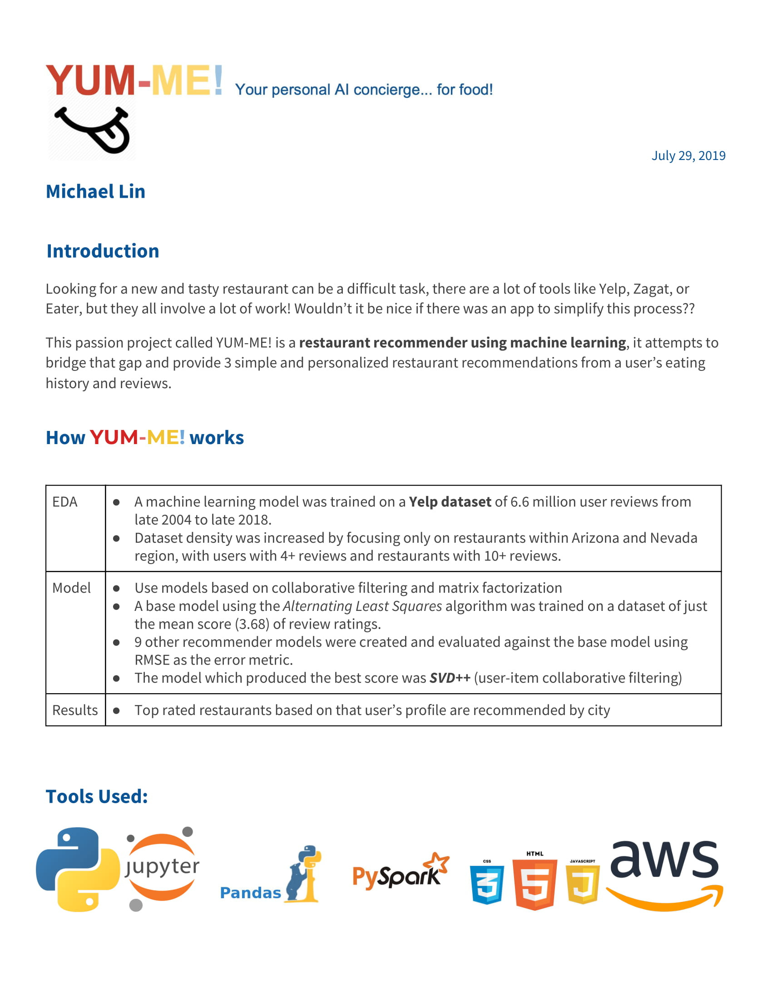

# Yelp recommender
creating a restaurant recommendation system using Yelp data

### Table of Contents
1. [Motivation](https://github.com/mik3up/yelp_restaurant_recommender#motivation)
2. [Data](https://github.com/mik3up/yelp_restaurant_recommender#the-data)
3. [Overview](https://github.com/mik3up/yelp_restaurant_recommender#overview)
4. [EDA & Pipeline](https://github.com/maxgrossenbacher/nlp_yelp_reviews#part-1)
5. [Web Demo](https://github.com/mik3up/yelp_restaurant_recommender#web-app)
6. [Conclusions](https://github.com/mik3up/yelp_restaurant_recommender#conclusion)
7. [Future Work](https://github.com/mik3up/yelp_restaurant_recommender#future-directions)
8. [Capstone Summary](https://github.com/mik3up/yelp_restaurant_recommender#future-directions)

## Motivation
One of my hobbies is discovering and trying out new places to try out.

I spend hours scouring Yelp, Google, Eater, and many other blogs for hints of where I can go next. However, I would rather there be a tool that knew my preferences and could recommend me places to go to based on my public user profile (i.e. Yelp)

I tackled this project with this goal in mind, using machine learning to recommend me places that I have never been to yet and may like.

## The Data:

[Yelp's Challenge Dataset](https://www.yelp.com/dataset/challenge) provides access to over 6.6 million user reviews.

## Overview
test

### EDA:
This is a distribution of the average rating of all business compared to the average rating of restaurants in the Yelp business dataset. As you can see, restaurants are rated on average only slightly higher than the global business average rating.
  
You can see a majority of reviews are rated 4 and 5 stars. The average restaurant rating is ~3.7.

#### Final Models:
| Target/Label | Model | Parameters | Accuracy | F1 score |  
|:------------:|:-----:|:----------:|:--------:|:--------:|
| usefulness | Random Forest | max_features: sqrt; n_estimators: 1000 | 62.5% | 0.625 |  
| sentiment | Gradient Boosted Trees | learning_rate: 0.1; max_features: sqrt; n_estimators: 500 | 68.0% | 0.680 |  
| rating | Gradient Boosted Trees | learning_rate: 0.1; max_features: sqrt; n_estimators: 500 | 50.7% | 0.504 |  

## Web App:
[The Yelp Review Scorer](https://github.com/maxgrossenbacher/nlp_yelp_reviews/tree/master/web_app) will process a Yelp-type review and output a usefulness score, sentiment score, and suggested rating. Scores are predicted using the final models and parameters obtained [above](https://github.com/maxgrossenbacher/nlp_yelp_reviews#final-models). Have fun!

## Conclusion:

Using the optimized models, we see a 28%, 25% and 30% increase in weighted F1 score for predicting rating, sentiment and usefulness of a review. Additionally, we can see that using doc2vec representations of reviews, instead of TF-IDF (bag-of-words) vectors, increases the predictive performance of each model by 46%, 34% and 31% respectively as compared to the Naive Bayes Baseline model.
Using The Yelp Review Scorer, users may score their model for probability of usefulness as well as overall sentiment and suggested rating. Hopefully, over time, more useful reviews will improve the user experience by providing users with more helpful and relevant reviews.

## Future Directions:

## Capstone Summary

